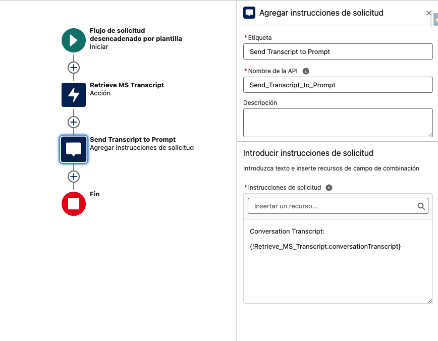

<div>
	
</div>

# _Sentiment Analysis_

<p align="center">
	
</p>

---

## Features

A component that shows a descriptive image of the Sentiment Analysis depending on the AI Generated input from a cusotm field within a Messaging Session

<p align="center">
	
</p>

## Getting Started

Here you'll find the Images and the Component to show the Sentiment Analysis within the V360 of a messaging session. You'll not find the custom field, so please follow the Prerequisites steps.

### Prerequisites

Please create a field within the Messaging Session object with the name 'Customer Sentiment' and the API name 'Customer_Sentiment\_\_c'. Within that field you can create a prompt template that analyses the conversation and writes some keywords within the first line:

Example of the prompt:

```
You are a Contact Center Supervisor evaluating the transcript of a messaging session with a customer to determine overall customer sentiment in relation to that specific conversation.
Sentiment is rated as Negative, Neutral, or Positive.
Follow my instructions below as you evaluate the transcript and use these criteria as a guideline for assessing the overall sentiment.

Instructions:
"""
Access the transcript here: {!$Flow:Prompt_Customer_Sentiment_Analysis.Prompt}
If there is no data in the transcript, don't make anything up. Tell me that there is no information available in the transcript to analyze.
Evaluate the transcript and use the following guidelines to assess the customer sentiment in the transcript.
Note that in the transcript, all customer phrases are preceded with "End User:" and that's how you can identify what parts of the conversation are attributed to the customer. These are the phrases you should focus on evaluating to determine the customer sentiment.
Tone and Polarity:
Positive Words/Phrases: Look for words indicating satisfaction, appreciation, or positive experiences (e.g., "thank you," "great," "satisfied").
Negative Words/Phrases: Identify words or phrases that indicate frustration, disappointment, or negative experiences (e.g., "unhappy," "frustrated," "poor service").
Emotion Words:
Emotional Indicators: Words that explicitly convey emotions (e.g., "angry," "happy," "excited," "disappointed").
Intensity of Language:
Strong Language: The use of strong adjectives or adverbs (e.g., "extremely dissatisfied," "absolutely wonderful").
Soft Language: Milder expressions of sentiment (e.g., "a bit upset," "quite happy").
Frequency of Sentiment Indicators:
Repetition: Repeated use of sentiment-laden words can indicate stronger emotions.
Contextual Sentiment:
Contextual Analysis: Consider the context in which words are used, as some words might have different meanings depending on the situation (e.g., "This is amazing" can be positive or sarcastic).
Customer Requests and Complaints:
Nature of Requests: Requests for help, resolution, or escalation often indicate dissatisfaction.
Complaints: Explicit complaints or mentions of issues faced during the interaction.
Resolution and Follow-Up:
Satisfaction with Resolution: Customer feedback on how well their issue was resolved (e.g., "This was resolved quickly" vs. "I'm still waiting for a solution").
Future Intentions: Statements indicating future actions, such as continuing or discontinuing service (e.g., "I will recommend your service" vs. "I will look for alternatives").
After you have completed your evaluation, provide me with an overall Sentiment Rating by choosing one of the following: Negative, Neutral or Positive

Negative means that based on the transcript, the customer appears to be dissatisfied with the interaction and the outcome of the conversation.
Neutral means that based on the transcript, the customer is neither dissatisfied or satisfied with the interaction and the outcome of the conversation.
Positive means that based on the transcript, the customer appears to happy and satisfied with the interaction and the outcome of the conversation.

When providing your analysis, start with the Sentiment Rating. Then provide me with a brief explanation for why you assigned that sentiment rating. For example:

Sentiment Rating: Positive
Customer used a lot of positive words and expressed appreciation multiple times for the assistance and resolution that was provided
"""

Now perform the evaluation.
```

The flow Prompt Customer Sentiment Analysis

<p align="center">
	
</p>

### Install

Deploy the source:

1. Clone this repository:

```
git clone https://github.com/gdedios/SentimentAnalysis.git
cd GDD_SentimentAnalysis
```

2. Authorize with your org and provide it with an alias (OrgAlias):

```
sfdx force:auth:web:login -a "OrgAlias"
```

3. Push the app to your org:

```
sfdx force:source:deploy --sourcepath force-app/main/default --json --loglevel fatal --targetusername "OrgAlias"
```

4. Open the default org:

```
sfdx force:org:open --targetusername "OrgAlias"
```

#### Does it work in Communities?

> No

#### Does it work in Mobile?

> Yes

#### Extras

There's an alternative that I totally recommend also, which is _[Caio Ono's Sentiment Analysis component](https://democomponents.qlabs.sfdc.sh/#/demo-component-detail/a01Kc000000M063IAC)_ . The use case is a little bit different but I think it's worth checking it
